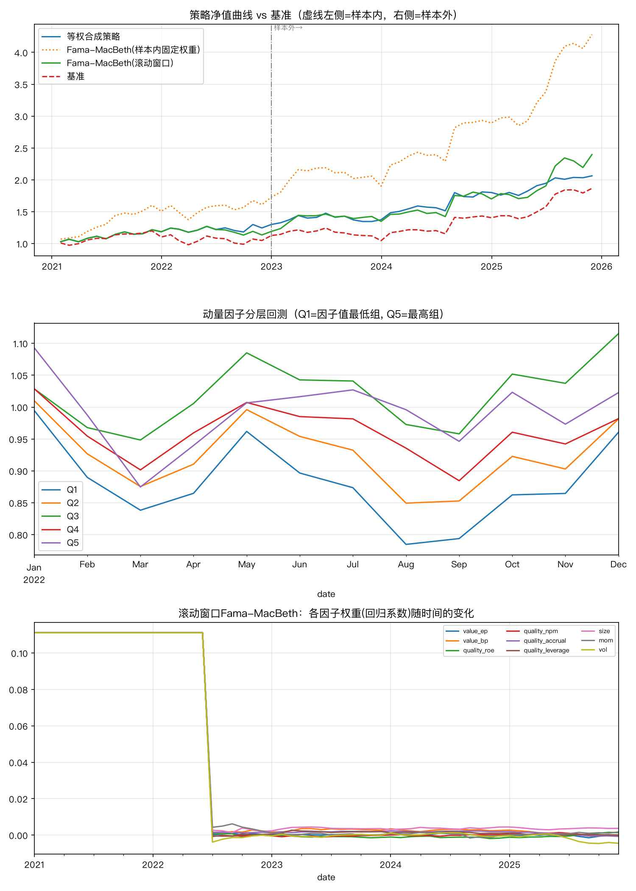

# 多因子选股策略回测

基于沪深300真实行情与财务数据，构建价值/质量/规模/动量/波动率五大类风格因子（质量因子由ROE、销售净利率、应计利润质量、资产负债率四项复合而成），通过样本内IC分析和分层回测验证因子有效性，再用Fama-MacBeth横截面回归法做多因子合成，构建月度调仓（带买入门槛+卖出缓冲控制换手率）的选股组合，并在从未用来调参的样本外区间做最终检验。

## 结果一览

沪深300**全量300只成分股**，样本内2021-01～2022-12（用于因子检验、确定权重），样本外2023-01～2025-12（全程不碰、只跑一次，覆盖3年、跨越弱市和强市两种环境），月度调仓，扣除双边千分之一交易成本后：

**样本内（拟合区间，表现天然偏乐观，仅作对比参考）**

| 策略 | 年化收益率 | 年化波动率 | 夏普比率 | 最大回撤 | 累计净值 |
|---|---|---|---|---|---|
| 基准（等权持有全部股票池） | 5.87% | 17.28% | 0.22 | -18.20% | 111.56% |
| 等权合成 | 12.90% | 14.58% | 0.75 | -6.94% | 126.17% |
| Fama-MacBeth - 样本内固定权重 | 28.39% | 17.75% | 1.49 | -14.10% | 161.43% |
| Fama-MacBeth - 滚动窗口 | 7.85% | 13.79% | 0.42 | -10.79% | 115.60% |

**样本外（唯一诚实的表现估计，全程没被用来调参）**

| 策略 | 年化收益率 | 年化波动率 | 夏普比率 | 最大回撤 | 累计净值 | 月均换手率 | 信息比率(vs基准) |
|---|---|---|---|---|---|---|---|
| 基准（等权持有全部股票池） | 18.83% | 19.03% | 0.88 | -15.95% | 163.06% | - | - |
| 等权合成 | 16.86% | 14.86% | 1.00 | -8.84% | 155.48% | 10.9% | -0.22 |
| **Fama-MacBeth - 样本内固定权重** | **35.59%** | 22.04% | **1.52** | -13.11% | **236.97%** | 11.8% | **+1.87** |
| Fama-MacBeth - 滚动窗口 | 26.36% | 21.03% | 1.16 | -7.79% | 194.05% | 16.4% | +0.81 |



## 一个值得展开讲的细节：把因子合成从IC加权换成Fama-MacBeth回归后，表现明显提升——但先做了怀疑式复核

早期版本用IC/ICIR做因子加权，样本外信息比率长期在0附近甚至为负（等权合成现在依然是-0.22，说明简单方法在这段样本外确实跑不赢基准）。换成Fama-MacBeth横截面回归（每月用因子值对下期收益做截面OLS回归，取回归系数当权重）之后，样本外信息比率跳到1.87——但提升幅度大到不正常，所以没有直接采信，先查了两件事：

**1）回归系数是否稳定？** 用普通OLS回归时，`value_ep`（单看IC是正的）系数变成负的，`quality_roe`（单看IC是负的）系数变成正的——这是因子之间共线性（value_ep和value_bp都是"便宜度"、几个质量因子之间也相关）导致的经典OLS不稳定现象。加入岭回归(Ridge)正则化后，做了一次强度扫描：

| 正则化强度 | value_ep系数方向 | quality_roe系数方向 | 样本外年化收益 | 样本外夏普 |
|---|---|---|---|---|
| 0（普通OLS） | 负（与IC相反） | 正（与IC相反） | 35.91% | 1.61 |
| 200（当前采用） | 正（与IC一致） | 负（与IC一致） | 35.59% | 1.52 |
| 3000（强正则化） | 正 | 负 | 35.76% | 1.40 |
| 10000（极强正则化） | 正 | 负 | 36.14% | 1.39 |

正则化强度加到200以上，系数符号就回到了和单因子IC一致的方向；更关键的是，**样本外表现在整个正则化强度区间里都很稳定**（年化34%-36%、夏普1.4-1.6），说明这次的提升不是"某个不稳定系数刚好蒙对方向"的巧合，而是相对稳健的结果。最终采用 `RIDGE_ALPHA=200`，兼顾"系数方向合理"和"样本外表现"。

**2）依然要提醒的一点**：这仍然只是一次样本外测试（2023-2025三年），单一时间窗口无法完全排除"这三年恰好对这套方法友好"的可能性，更严谨的验证需要多个不同的样本外窗口（比如再往前/往后滚动切几段），这是这个项目目前最值得继续做的下一步。

## 另一个值得讲的细节：样本内/样本外的落差，是过拟合的度量

"Fama-MacBeth-样本内固定权重"策略的权重完全用样本内(2021-2022)数据"训练"出来，样本内夏普1.49、样本外夏普1.52——两者非常接近，说明这组权重没有明显对样本内历史"死记硬背"，泛化能力还不错（作为对比，早期IC加权版本的样本内外落差要大得多）。"滚动窗口"版本没有"先拟合、再原样应用"这一步，每月权重只用当时已发生的历史滚动更新，更保守也更不容易过拟合。

这套"样本内挑参数、样本外只跑一次"的流程，也是为了避免一个更隐蔽的问题：如果连"选哪些因子、因子怎么加权"这件事本身都用了全部历史（包括最后拿来验证的那段），那"验证"就失去意义了——这和"未来函数"是同一类问题，只是发生在更早的"因子筛选"这一步，而不是"回测执行"这一步。

## 方法论

1. **因子构建**：
   - 价值：EP（市盈率倒数）、BP（市净率倒数）
   - 质量（复合）：ROE、销售净利率、应计利润质量（EPS-每股经营现金流，反向）、资产负债率（反向）
   - 规模：对数市值（反向，小市值效应）
   - 动量：过去12个月收益剔除最近1个月
   - 波动率：过去60日收益标准差（反向，低波动效应）
2. **预处理**：去极值（MAD）→ 行业中性化 → 标准化（z-score）
3. **样本内/样本外切分**：2021-01～2022-12为样本内，2023-01～2025-12为样本外，样本外区间从不参与因子筛选或调参
4. **有效性检验**：只用样本内数据，逐月Spearman rank IC，计算IC均值、ICIR、t统计量、胜率；再做五分位分层回测验证单调性
5. **多因子合成**：等权 / Fama-MacBeth-样本内固定权重（样本内回归系数均值，样本外冻结应用）/ Fama-MacBeth-滚动窗口（权重逐月用截至当期的历史回归系数滚动更新，天然无未来函数），回归本身用岭回归(Ridge)正则化缓解因子共线性
6. **组合回测**：月度调仓，买入门槛(前20%)+卖出缓冲(前30%内继续持有)控制换手率，扣除双边交易成本，样本内/样本外分开报告绩效
7. **绩效评估**：年化收益、夏普比率、最大回撤、信息比率，并用"样本内夏普 - 样本外夏普"的落差衡量过拟合程度

## 数据

全部来自 [akshare](https://github.com/akfamily/akshare) 封装的公开接口：

| 数据 | 接口 | 来源 |
|---|---|---|
| 沪深300成分股 | `index_stock_cons_csindex` | 中证指数 |
| 行情 + 流通股本（前复权） | `stock_zh_a_daily` | 新浪财经 |
| PE(TTM) / PB | `stock_zh_valuation_baidu` | 百度股市通 |
| ROE/销售净利率/资产负债率/每股收益/每股经营现金流（单季度，同一接口一次拿全） | `stock_financial_abstract_ths` | 同花顺 |
| 行业分类 | `stock_industry_clf_hist_sw` | 申万（部分网络环境下不稳定，失败时自动降级跳过行业中性化） |

财务数据额外做了45天公告滞后处理，避免用到还未公布的报表数据。

## 已知局限

- **只有一个样本外窗口**：2023-2025这一段样本外表现很强，但仅凭一次样本外测试无法完全排除"这段时期恰好对这套方法友好"的可能，更严谨的做法是滚动切多段样本内/样本外反复验证（比如再往前推、把IN_SAMPLE_END挪到不同位置重跑几次），这是目前最值得补的一块
- **简单方法（等权合成）在这段样本外并没有跑赢基准**（信息比率-0.22），说明"跑赢基准"主要归功于Fama-MacBeth回归带来的因子组合方式，而不是这几个因子本身有多神奇——面试时如果被问"是不是随便找几个因子就能有这个效果"，诚实的答案是"不是，合成方法的选择影响很大"
- **幸存者偏差**：用的是当前沪深300成分股名单去跑历史回测，历史上曾被剔除/退市的成分股没有被包含，回测结果可能偏乐观
- **交易成本简化**：只按固定bp假设扣成本，没有考虑冲击成本和涨跌停限制，实盘表现会比回测差
- **行业分类偶尔缺失**：申万行业接口在部分网络环境下会连接失败，此时会跳过行业中性化这一步（脚本会打印明确提示），300只股票全部拿不到行业标签时，因子暴露里可能藏着行业集中度风险

## 如何运行

```bash
pip install -r requirements.txt
python factor_backtest.py
```

默认 `USE_REAL_DATA = True`，会用 akshare 拉取真实数据（首次运行需要联网，单只股票的数据会缓存到 `data_cache/`，重复运行不会重新请求网络）。改成 `USE_REAL_DATA = False` 可以用内置的模拟数据跑通整套逻辑，不依赖网络。

主要配置项都在文件顶部：

```python
USE_REAL_DATA = True
REAL_DATA_N_STOCKS = 300     # 真实数据模式下取沪深300前N只，300为全量
START_DATE = "2021-01-01"
END_DATE = "2025-12-31"
IN_SAMPLE_END = "2022-12-31" # 样本内截止日，之后到END_DATE是样本外测试区间
TOP_QUANTILE = 0.2           # 买入门槛：前20%
HOLD_BUFFER_QUANTILE = 0.3   # 卖出缓冲：已持仓的前30%内继续持有，降低换手率
TRANSACTION_COST_BPS = 10    # 单边交易成本
ROLLING_WINDOW = 24          # 滚动合成权重的窗口期数
RIDGE_ALPHA = 200            # Fama-MacBeth回归的岭回归正则化强度
```

## 项目结构

```
factor_backtest.py   # 全部逻辑：数据获取、因子构建、IC检验、组合回测、绩效评估
requirements.txt
data_cache/           # 运行后自动生成，缓存原始数据（已加入.gitignore）
factor_backtest_result.png   # 运行后自动生成的结果图
```
